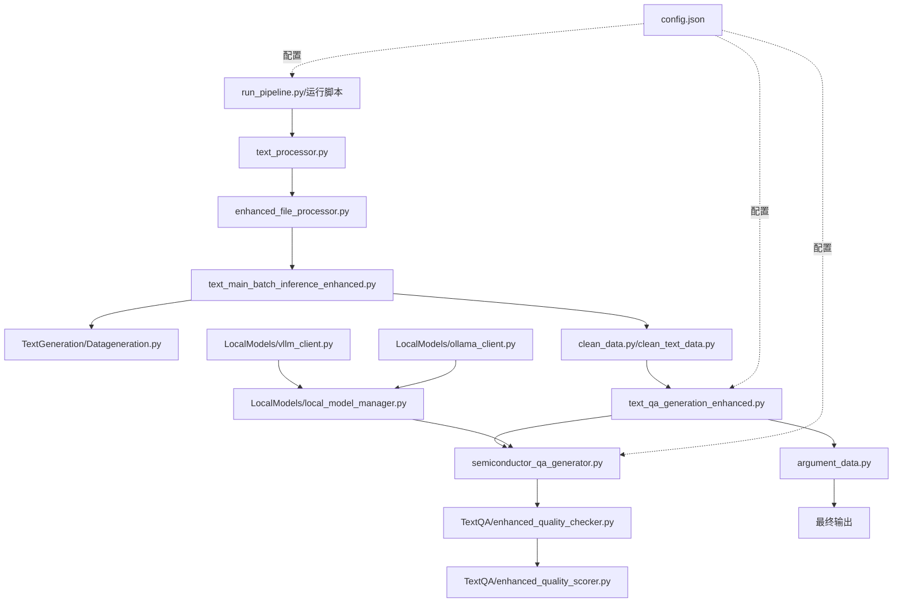

# 半导体显示技术领域智能QA生成系统

## 项目概述

本项目是一个专门针对半导体显示技术领域的智能问答生成系统，整合了文本质量评估、问题生成、答案验证等功能。系统支持从学术论文和技术文档中自动生成高质量的逻辑推理问题。

## 核心功能

### 1. 文本处理与过滤
- **智能文本过滤**：自动过滤参考文献、致谢、目录等无关内容
- **中文内容检测**：确保文本包含足够的中文内容
- **学术论文清洗**：去除论文中的格式化内容和元数据

### 2. 质量评估系统
- **四维度评分标准**：
  - 问题完整性（0-2分）
  - 问题复杂性和技术深度（0-2分）
  - 技术正确性和准确性（-1-1分）
  - 思维和推理能力（-1-2分）
- **自动质量判定**：基于评分自动判断文本是否适合生成推理问题

### 3. 问题生成
- **专业问题模板**：针对半导体显示技术领域的专业问题生成
- **逻辑推理导向**：生成需要深度推理才能解答的问题
- **背景独立性**：确保问题不依赖原文即可理解

### 4. 模型支持
- **API模型**：支持OpenAI兼容API（ARK）
- **本地模型**：
  - Ollama支持
  - vLLM高性能推理（支持QwQ-32B等大模型）
  - 批量推理优化

## 项目结构

```
/workspace/
├── TextGeneration/          # 文本生成模块
│   ├── text_filter.py      # 文本过滤功能
│   ├── prompts_conf.py     # 提示词配置
│   ├── reasoning_prompts.py # 推理提示词
│   ├── Datageneration.py   # 数据生成主逻辑
│   └── Datageneration1.py  # 数据生成备用版本
├── TextQA/                  # 问答生成模块
│   ├── quality_assessment_templates.py  # 质量评估模板
│   ├── enhanced_quality_scorer.py       # 增强质量评分器
│   ├── enhanced_quality_checker.py      # 增强质量检查器
│   └── dataargument.py                  # 数据增强
├── LocalModels/             # 本地模型支持
│   ├── ollama_client.py    # Ollama客户端
│   ├── vllm_client.py      # vLLM客户端
│   └── local_model_manager.py  # 模型管理器
├── MultiModal/              # 多模态处理
│   └── pdf_processor.py    # PDF处理器
├── Qwen/                    # Qwen模型相关
├── WizardLM/               # WizardLM模型相关
├── Doubao/                 # 豆包模型相关
├── Utilis/                 # 工具模块
├── data/                   # 数据目录
│   ├── texts/              # 输入文本文件
│   ├── pdfs/               # 输入PDF文件
│   ├── output/             # 中间输出结果
│   ├── qa_results/         # QA生成结果
│   ├── cleaned/            # 清洗后数据
│   ├── retrieved/          # 召回数据
│   ├── rewritten/          # 改写数据
│   └── quality_checked/    # 质量检查结果
├── model_rewrite/          # 模型改写相关
│   ├── data_label.py       # 数据标注
│   ├── simple_rewrite.py   # 简单改写
│   └── data_generation_*.py # 数据生成变体
├── config.json             # 配置文件
├── requirements.txt        # 依赖包
└── 运行脚本/               # 各种运行脚本
    ├── quick_start.sh      # 快速启动脚本
    ├── run_full_pipeline.sh # 完整流程脚本
    ├── run_step_by_step.sh  # 分步运行脚本
    └── run_text_only.sh     # 仅文本处理脚本
```

## 核心文件功能详解

### 1. 主流程控制文件

#### **run_pipeline.py**
- **功能**：整合版统一流水线，是整个系统的主控制器
- **特性**：
  - 支持完整流水线和单步执行
  - 集成多模态处理
  - 支持本地模型和API模型切换
  - 提供进度监控和错误处理

#### **semiconductor_qa_generator.py**
- **功能**：半导体领域QA生成的核心业务逻辑
- **特性**：
  - 完整的三步评估流程
  - 支持vLLM高性能推理
  - 批量处理优化
  - 详细的质量评分机制

### 2. 文本处理模块

#### **text_processor.py**
- **功能**：文本预处理和初步过滤
- **输入**：原始文本文件目录
- **输出**：过滤后的文本数据

#### **enhanced_file_processor.py**
- **功能**：增强型文件处理器
- **特性**：
  - 支持多种文件格式
  - 智能内容过滤
  - 中文内容检测
  - 参考文献自动识别

#### **text_main_batch_inference_enhanced.py**
- **功能**：批量文本召回和推理
- **特性**：
  - 异步并发处理
  - 支持断点续传
  - 批量优化
  - 进度跟踪

### 3. 数据清洗模块

#### **clean_data.py**
- **功能**：清洗召回的数据
- **输入**：pkl格式的原始召回数据
- **输出**：JSON格式的清洗数据

#### **clean_text_data.py**
- **功能**：专门的文本数据清洗
- **特性**：
  - 去除无效字符
  - 格式标准化
  - 质量初筛

### 4. QA生成模块

#### **text_qa_generation.py**
- **功能**：基础QA生成
- **特性**：
  - 问题生成
  - 答案生成
  - 基础质量控制

#### **text_qa_generation_enhanced.py**
- **功能**：增强版QA生成
- **特性**：
  - 详细质量评分
  - 多轮质量检查
  - 支持质量阈值设置
  - 推理能力评估

### 5. 质量控制模块

#### **TextQA/enhanced_quality_checker.py**
- **功能**：增强质量检查器
- **特性**：
  - 四维度评分
  - 自动筛选
  - 详细报告生成

#### **TextQA/enhanced_quality_scorer.py**
- **功能**：质量评分器
- **特性**：
  - 细粒度评分
  - 可配置评分标准
  - 支持批量评分

### 6. 数据增强模块

#### **argument_data.py**
- **功能**：数据增强和论证生成
- **特性**：
  - 问题改写
  - 答案扩充
  - 多样性增强

## 文件调用关系图



## 详细运行流程

### 完整处理流程（7步）

1. **数据准备**
   - 将文本文件放入 `data/texts/` 目录
   - 将PDF文件放入 `data/pdfs/` 目录

2. **文本预处理与过滤**
   ```bash
   python3 text_processor.py --input data/texts --output data/output
   ```

3. **文本召回与批量推理**
   ```bash
   python3 text_main_batch_inference_enhanced.py \
     --txt_path data/texts \
     --storage_folder data/output \
     --parallel_batch_size 100
   ```

4. **数据清洗**
   ```bash
   python3 clean_text_data.py \
     --input_file data/output/total_response.pkl \
     --output_file data/output
   ```

5. **QA生成**
   ```bash
   python3 text_qa_generation_enhanced.py \
     --file_path data/output/total_response.json \
     --output_file data/qa_results \
     --enhanced_quality true
   ```

6. **质量检查**
   ```bash
   python3 text_qa_generation_enhanced.py \
     --check_task true \
     --file_path data/qa_results/results_343.json \
     --quality_threshold 0.7
   ```

7. **数据增强与最终输出**
   ```bash
   python3 argument_data.py \
     --input_file data/qa_results/results_343.json \
     --output_file data/final_output
   ```

## 一键运行

### 方式一：快速启动脚本
```bash
# 首次使用，安装依赖
./quick_start.sh --install

# 检查环境
./quick_start.sh --check

# 运行完整演示
./quick_start.sh --demo

# 运行完整流水线
./quick_start.sh --pipeline
```

### 方式二：完整流程脚本
```bash
# 运行完整的7步流程
./run_full_pipeline.sh
```

### 方式三：仅处理文本
```bash
# 快速处理文本文件
./run_text_only.sh
```

### 方式四：使用主控制器
```bash
# 使用Python主控制器运行
python3 run_pipeline.py --mode full --input data/texts --output data/final_output
```

## 分步运行

### 交互式分步运行
```bash
# 启动交互式菜单
./run_step_by_step.sh
```

菜单选项：
- 0: 环境准备与检查
- 1: 文本预处理与过滤
- 2: 文本召回与批量推理
- 3: 数据清洗
- 4: QA生成
- 5: 质量检查
- 6: 数据增强（可选）
- 7: 最终输出整理
- 8: 查看统计报告
- 9: 运行完整流程

### 手动分步运行
```bash
# 步骤1: 环境准备
export PYTHONPATH="${PYTHONPATH}:$(pwd)"
mkdir -p data/texts data/pdfs data/output data/qa_results data/final_output

# 步骤2: 文本预处理
python3 text_processor.py --input data/texts --output data/output --index 9

# 步骤3: 文本召回
python3 text_main_batch_inference_enhanced.py \
  --txt_path data/texts \
  --storage_folder data/output \
  --index 43

# 步骤4: 数据清洗
python3 clean_text_data.py \
  --input_file data/output/total_response.pkl \
  --output_file data/output

# 步骤5: QA生成
python3 text_qa_generation_enhanced.py \
  --file_path data/output/total_response.json \
  --output_file data/qa_results \
  --index 343

# 步骤6: 质量检查
python3 text_qa_generation_enhanced.py \
  --check_task true \
  --file_path data/qa_results/results_343.json

# 步骤7: 数据增强（可选）
python3 argument_data.py \
  --input_file data/qa_results/results_343.json \
  --output_file data/qa_results/enhanced_results.json

# 步骤8: 查看结果
cat data/final_output/statistics_report.json
```

## 安装与配置

### 1. 快速安装

```bash
# 克隆项目后，运行环境设置脚本
chmod +x setup_environment.sh
./setup_environment.sh

# 激活虚拟环境
source activate_env.sh
```

### 2. 手动安装

```bash
# 创建虚拟环境
python3 -m venv venv
source venv/bin/activate

# 安装依赖
pip install -r requirements.txt

# 创建必要目录
mkdir -p data/{texts,pdfs,output,qa_results,final_output}
mkdir -p logs cache
```

### 3. 环境要求

- Python 3.8+
- CUDA 11.8+（如使用GPU）
- 足够的GPU内存（建议32GB+用于大模型）

## 配置说明

### config.json 主要配置项

```json
{
  "api": {
    "use_local_models": false,  // 是否使用本地模型
    "default_backend": "ark"     // 默认后端：ark/ollama/vllm
  },
  "models": {
    "local_models": {
      "vllm": {
        "model_path": "/path/to/model",
        "tensor_parallel_size": 4
      }
    }
  },
  "processing": {
    "batch_size": 32,           // 批处理大小
    "max_concurrent_tasks": 100, // 最大并发任务数
    "enable_text_filtering": true // 启用文本过滤
  },
  "quality_control": {
    "min_quality_score": 0.7,   // 最低质量分数
    "enhanced_quality_check": {
      "enabled": true,
      "quality_threshold": 0.7
    }
  }
}
```

## 使用vLLM加速

### 1. 启动vLLM服务
```bash
python3 -m vllm.entrypoints.openai.api_server \
  --model /path/to/QwQ-32B \
  --tensor-parallel-size 4 \
  --gpu-memory-utilization 0.95
```

### 2. 配置使用vLLM
修改 `config.json`：
```json
{
  "api": {
    "use_local_models": true,
    "default_backend": "vllm"
  }
}
```

### 3. 运行流程
```bash
./run_full_pipeline.sh
```

## 输出格式

### QA对格式
```json
{
  "source_file": "paper_001.txt",
  "qa_pairs": [
    {
      "question": "在IGZO-TFT器件中...",
      "answer": "阈值电压会负向偏移...",
      "question_type": "reasoning",
      "quality_score": 0.85,
      "quality_details": {
        "completeness": 2,
        "complexity": 2,
        "accuracy": 1,
        "reasoning": 2
      }
    }
  ],
  "metadata": {
    "domain": "semiconductor",
    "processed_at": "2024-01-01T12:00:00",
    "model_used": "Skywork-R1V3-38B"
  }
}
```

### 统计报告格式
```json
{
  "total_qa_pairs": 150,
  "total_source_files": 10,
  "question_type_distribution": {
    "reasoning": 120,
    "factual": 30
  },
  "average_qa_per_file": 15.0,
  "average_quality_score": 0.82,
  "processing_time": "00:45:30"
}
```

## 测试安装

运行测试脚本验证安装：

```bash
python3 test_installation.py
```

该脚本会检查：
- Python版本
- 核心依赖安装情况
- 项目目录结构
- 配置文件完整性
- 示例数据
- 核心模块导入

## 常见问题解决

### 1. 依赖安装失败
```bash
# 使用国内镜像
pip3 install -r requirements.txt -i https://pypi.tuna.tsinghua.edu.cn/simple
```

### 2. GPU内存不足
- 减小 `batch_size` 和 `parallel_batch_size`
- 降低 `gpu_memory_utilization`
- 使用更小的模型

### 3. 文本过滤过于严格
- 调整 `config.json` 中的 `min_chinese_ratio`
- 修改 `filter_references` 和 `filter_acknowledgments` 设置

### 4. 质量评分过低
- 检查输入文本质量
- 调整 `quality_threshold`
- 使用更好的模型

### 5. 处理速度慢
- 增加 `parallel_batch_size`
- 使用vLLM加速
- 启用批量处理

## 性能优化建议

1. **批量处理优化**
   - 根据GPU内存调整批量大小
   - 使用异步并发处理

2. **模型选择**
   - 大模型效果更好但速度慢
   - 可以分阶段使用不同模型

3. **缓存策略**
   - 启用 `enable_caching` 避免重复处理
   - 定期清理缓存目录

4. **并行化**
   - 多GPU环境设置 `tensor_parallel_size`
   - 调整 `max_concurrent_tasks`

## 扩展开发

### 添加新的领域支持
1. 在 `config.json` 的 `domains` 中添加新领域
2. 在 `TextGeneration/prompts_conf.py` 中添加领域特定提示词
3. 更新质量评估标准

### 集成新的模型
1. 在 `LocalModels/` 下创建新的客户端
2. 在 `local_model_manager.py` 中注册
3. 更新配置文件

## 贡献指南

欢迎提交Issue和Pull Request来改进系统。

## 许可证

本项目采用MIT许可证。